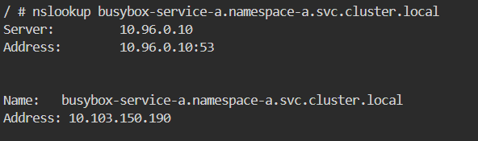

## steps to test the scenario

Below are the detailed steps to ensure your pod can communicate using DNS within a Kubernetes cluster:

### Step 1: Ensure DNS Tools are Available in the Pod

BusyBox typically comes with `nslookup` and `wget` which are sufficient for basic DNS resolution and HTTP requests.

First, create two namespaces: namespace-a and namespace-b.

```bash
kubectl create namespace namespace-a
kubectl create namespace namespace-b
```

### Step 2: Verify the Cluster DNS Add-on

Ensure that the DNS add-on (`kube-dns` or `CoreDNS`) is running in your cluster. Usually, this is set up by default in most Kubernetes distributions.

Check if the DNS pods are running:

```bash
kubectl get pods -n kube-system -l k8s-app=kube-dns
```

### Step 3: Create and Configure Services

Ensure you have created services for your pods. These services will have DNS entries created automatically by Kubernetes.

### Step 4: Test DNS Resolution in the Pod

You can test DNS resolution by running commands directly in the pod. Here’s how you can do it:

1. **Deploy the BusyBox Pod in `namespace-a` with HTTP Server**:

```yaml
  apiVersion: apps/v1
  kind: Deployment
  metadata:
  name: mc1-deployment
  namespace: namespace-a
  spec:
  replicas: 1
  selector:
  matchLabels:
  app: mc1
  template:
  metadata:
  labels:
  app: mc1
  spec:
  volumes: - name: html
  emptyDir: {}
  containers: - name: 1st
  image: nginx
  volumeMounts: - name: html
  mountPath: /usr/share/nginx/html - name: 2nd
  image: debian
  volumeMounts: - name: html
  mountPath: /html
  command: ["/bin/sh", "-c"]
  args: - while true; do
  echo "Hello from 2nd container in deployment mc1" >> /html/index.html;
  date >> /html/index.html;
  sleep 1;
  done
```

Apply the deployment:

```bash
kubectl apply -f busybox-deployment-a.yaml
```

1. **Deploy the Service for BusyBox in `namespace-a`**:

```yaml
    apiVersion: v1
    kind: Service
    metadata:
      name: mc1-service-a
      namespace: namespace-a
    spec:
      selector:
        app: mc1
      ports:
        - protocol: TCP
          port: 80
          targetPort: 80
```

Apply the service:

```bash
kubectl apply -f busybox-service-a.yaml
```

2. **Deploy the BusyBox Pod in `namespace-b` to Communicate with `namespace-a`**:

```yaml
apiVersion: apps/v1
kind: Deployment
metadata:
  name: busybox-deployment-b
  namespace: namespace-b
spec:
  replicas: 1
  selector:
    matchLabels:
      app: busybox-b
  template:
    metadata:
      labels:
        app: busybox-b
    spec:
      containers:
      - name: busybox
        image: busybox
        command: ['sh', '-c', 'while true; do wget -qO- http://mc1-service-a.namespace-a.svc.cluster.local; sleep 10; done']
```

Apply the deployment:

```bash
kubectl apply -f busybox-deployment-b.yaml
```

3. **Test DNS Resolution by Executing into the Pod in `namespace-b`**:

```bash
kubectl exec -it <pod-name> -n namespace-b -- sh
```

Inside the pod, test DNS resolution:

```sh
nslookup mc1-service-a.namespace-a.svc.cluster.local
```

You should see the DNS resolution output with the IP address of the service.



### Step 5: Check another command for Communication Verification

Finally, check the output of command below to verify communication:

```sh
 wget -qO- http://mc1-service-a.namespace-a.svc.cluster.local
````

you should see message printed in html page.

By following these steps, you ensure that your pod image is capable of DNS communication within a Kubernetes cluster, and you verify that the DNS resolution is working correctly.
