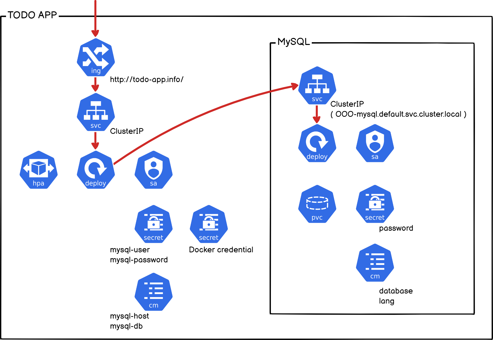

Let's take a closer look using the **ToDo App** that we are familiar with.
The chart has the following structure. It contains many things we have learned.



<br><br><br>

Installation is simple. Just one command. 
```bash 
controlplane $ helm install my-todo-app https://github.com/JungSangup/mspt3/raw/main/hands_on_files/todo-app-1.0.0.tgz NAME: my-todo-app LAST DEPLOYED: Sat Mar 4 08:13:33 2023 NAMESPACE: default STATUS: deployed REVISION: 1 TEST SUITE: None NOTES: 1. Get the application URL by running these commands: http://todo-app.info/ 
```

 > 💻 Command `helm install my-todo-app https://github.com/JungSangup/mspt3/raw/main/hands_on_files/todo-app-1.0.0.tgz`{{exec}} 
 
 <br> The above method uses Helm. This was installed by directly specifying the URL of the chart package file (the file uploaded to GitHub).
In addition to the method above, there are various other ways to install it.

> - `helm install my-todo-app ./todo-app-1.0.0.tgz` -> tgz file in the local path (packaged Helm chart)
> - `helm install my-todo-app ./todo-app` -> chart directory in the local path

<br><br><br>

First, I will uninstall this Helm release. I will reinstall it later using a different method.
```bash
controlplane $ helm uninstall my-todo-app
release "my-todo-app" uninstalled
```

> 💻 Command `helm uninstall my-todo-app`{{exec}}

<br>

The status after organizing is as follows. ```bash
controlplane $ helm list
NAME NAMESPACE REVISION UPDATED STATUS CHART APP VERSION
controlplane $
```

> 💻 Command `helm list`{{exec}}

<br><br><br>

This time, we will install it with a slightly different configuration.

We will use the image uploaded to your **Docker private repository** and use **credentials** to pull the image.

You can also run it simply as follows. 
```bash 
controlplane $ helm install my-todo-app \ > --set image.repository=rogallo/todo-app \ > --set imageCredentials.create=true \ > --set imageCredentials.username=rogallo \ > --set imageCredentials.password=XXXXXX \ > https://github.com/JungSangup/mspt3/raw/main/hands_on_files/todo-app-1.0.0.t gz NAME: my-todo-app LAST DEPLOYED: Sat Mar 4 08:21:31 2023 NAMESPACE: default STATUS: deployed REVISION: 1 TEST SUITE: None NOTES: 1. Get the application URL by running these commands: http://todo-app.info/ 
``` 

> 💻 Command
>```bash
>helm install my-todo-app \
> --set image.repository=[USER-NAME]/todo-app \
> --set imageCredentials.create=true \
> --set imageCredentials.username=[USER-NAME] \
> --set imageCredentials.password=[PASSWORD] \
> https://github.com/JungSangup/mspt3/raw/main/hands_on_files/todo-app-1.0.0.tgz
>```{{copy}}
> Please fill in [USER-NAME] and [PASSWORD] with your information. (Please modify and run using an editor such as Notepad.)

The following key-values ​​were changed and applied at the time of installation.
image.repository is used to pull from your Private repository, and the imageCredentials values ​​are used to create a Secret for Docker Hub credentials.
- image.repository=[USER-NAME]/todo-app
- imageCredentials.create=true
- imageCredentials.username=[USER-NAME]
- imageCredentials.password=[PASSWORD]

<br><br><br>

Connect and test it out. (Connect to NodePort)

🔗 [ToDo List Manager]({{TRAFFIC_HOST1_30007}})


Is it working?

<br><br><br>

Check the created K8s resources. 

> 💻 Command `kubectl get all`{{exec}}

<br><br><br>

In order to pull images from a private repository, credentials were also created as secret. ```base
controlplane $ kubectl describe secrets regcred
Name: regcred
Namespace: default
Labels: app.kubernetes.io/managed-by=Helm
Annotations: meta.helm.sh/release-name: my-todo-app
meta.helm.sh/release-namespace: default

Type: kubernetes.io/dockerconfigjson

Data
====
.dockerconfigjson: 135 bytes
```

> 💻 Command `kubectl describe secrets regcred`{{exec}}

<br><br><br>

Please also check other resources (ConfitMap, Secret, PVC, PV, Ingress). 

```base 
controlplane $kubectl get configmaps NAME DATA AGE kube-root-ca.crt 1 8d my-todo-app-config 2 2m10s mysql-config 2 2m10s controlplane $kubectl get secrets
NAME                                TYPE                             DATA   AGE
my-todo-app-secret                  Opaque                           2      2m17s
mysql-secret                        Opaque                           1      2m17s
regcred                             kubernetes.io/dockerconfigjson   1      2m17s
sh.helm.release.v1.my-todo-app.v1   helm.sh/release.v1               1      2m17s
controlplane $ kubectl get pvc
NAME                          STATUS   VOLUME                                     CAPACITY   ACCESS MODES   STORAGECLASS   AGE
data-my-wordpress-mariadb-0   Bound    pvc-c4ba2b76-eacb-434b-98b8-844f2d25daef   8Gi        RWO            local-path     9m57s
mysql-pvc                     Bound    pvc-2ea83c79-5490-4059-b21e-1c9c3f08c4a8   3Gi        RWO            local-path     2m23s
controlplane $ kubectl get pv
NAME                                       CAPACITY   ACCESS MODES   RECLAIM POLICY   STATUS   CLAIM                                 STORAGECLASS   REASON   AGE
pvc-2ea83c79-5490-4059-b21e-1c9c3f08c4a8   3Gi        RWO            Delete           Bound    default/mysql-pvc                     local-path              2m26s
pvc-c4ba2b76-eacb-434b-98b8-844f2d25daef   8Gi        RWO            Delete           Bound    default/data-my-wordpress-mariadb-0   local-path              9m58s
controlplane $ kubectl get ingress
NAME          CLASS    HOSTS           ADDRESS   PORTS   AGE
my-todo-app   <none>   todo-app.info             80      2m36s
```

> 💻 Command
>```bash
>kubectl get configmaps
>```{{exec}}
>```bash
>kubectl get secrets
>```{{exec}}
>```bash
>kubectl get pvc
>```{{exec}}
>```bash
>kubectl get pv
>```{{exec}}
>```bash
>kubectl get ingress
>```{{exec}}

<br><br><br>

Now let's do **upgrade** in Helm.
There are various upgrades, but let's just change the image tag.
```bash
controlplane $ helm upgrade --set image.tag=2.0.0 my-todo-app https://github.com/JungSangup/mspt3/raw/main/hands_on_files/todo-app-1.0.0.tgz
Release "my-todo-app" has been upgraded. Happy Helming!
NAME: my-todo-app
LAST DEPLOYED: Sat Mar  4 10:34:22 2023
NAMESPACE: default
STATUS: deployed
REVISION: 2
TEST SUITE: None
NOTES:
1. Get the application URL by running these commands:
http://todo-app.info/
```
> 💻 Command `helm upgrade --set image.tag=2.0.0 my-todo-app https://github.com/JungSangup/mspt3/raw/main/hands_on_files/todo-app-1.0.0.tgz`{{exec}}
> Upgrade to the new version by changing only **image.tag**.

<br><br><br>

Check the changed Deployment as well.
Like this.

```bash
controlplane $ kubectl describe deployments my-todo-app | grep Image
Image:      rogallo/101-todo-app:2.0.0
```

> 💻 Command `kubectl describe deployments my-todo-app | grep Image`{{exec}}

<br><br><br>
Please connect and test it. (Connect to NodePort)

🔗 [ToDo List Manager]({{TRAFFIC_HOST1_30007}})


> I have displayed the version at the bottom to distinguish it.

<br><br><br>

Should I try rolling back?
Simply check the History and go back to the desired **Revision**.

```bash
controlplane $ helm history my-todo-app
REVISION        UPDATED                         STATUS          CHART           APP VERSION     DESCRIPTION
1               Sat Mar  4 10:31:07 2023        superseded      todo-app-1.0.0  1.0.0           Install complete
2               Sat Mar  4 10:34:22 2023        deployed        todo-app-1.0.0  1.0.0           Upgrade complete
controlplane $ helm rollback my-todo-app 1
Rollback was a success! Happy Helming!
controlplane $ kubectl describe deployments my-todo-app | grep Image
Image:      rogallo/todo-app:1.0.0
```

> 💻 Command
>```bash
>helm history my-todo-app
>```{{exec}}
>```bash
>helm rollback my-todo-app 1
>```{{exec}}
>```bash
>kubectl describe deployments my-todo-app | grep Image
>```{{exec}}

Please check the screen too.

🔗 [ToDo List Manager]({{TRAFFIC_HOST1_30007}})

<br><br><br>

Finally, the last step is to organize. Please uninstall using the command below.

```bash
controlplane $ helm uninstall my-todo-app
release "my-todo-app" uninstalled
```

> 💻 Command `helm uninstall my-todo-app`{{exec}}

<br>

After cleaning, the status is as follows.
```bash
controlplane $ helm list
NAME    NAMESPACE       REVISION        UPDATED STATUS  CHART   APP VERSION
controlplane $
```

> 💻 Command `helm list`{{exec}}

.